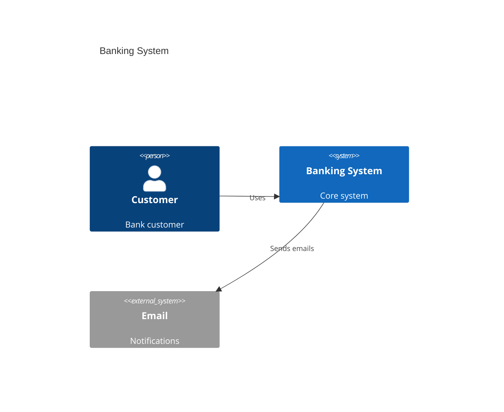
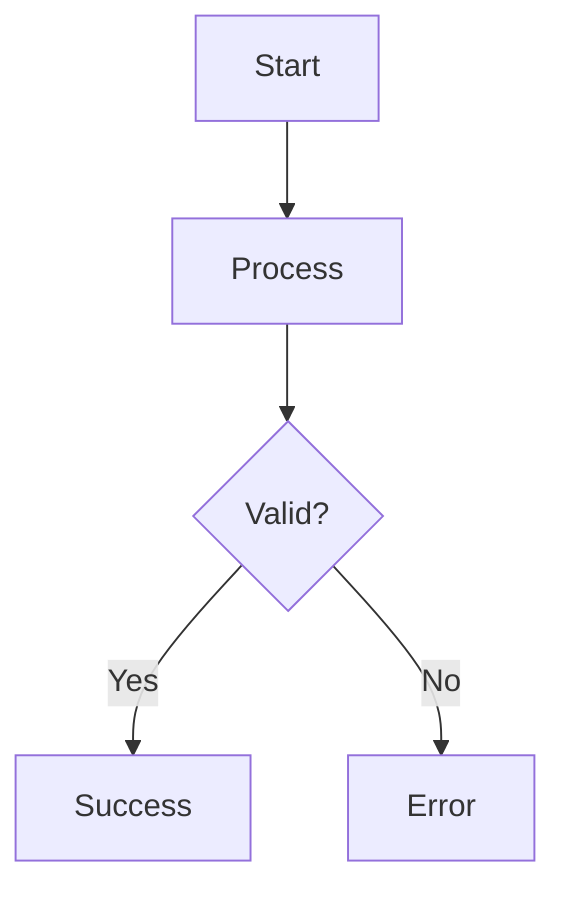

# Flow & Diagrams Feature - Implementation Summary

## What Was Built

A comprehensive text-to-diagram feature that allows users to create professional diagrams using simple text syntax, powered by Mermaid.js.

## Key Features

### 1. Dual Diagram Modes

- **Text-Based**: Create diagrams using Mermaid syntax
- **Visual Editor**: Existing drag-and-drop interface (unchanged)

### 2. Eight Diagram Categories

1. **C4 Diagrams** - Software architecture (Context, Container, Component)
2. **Flowcharts** - Process flows and decision trees
3. **Sequence Diagrams** - Time-ordered interactions
4. **Class Diagrams** - Object-oriented design
5. **ER Diagrams** - Database entity relationships
6. **Gantt Charts** - Project timelines
7. **State Diagrams** - State machines
8. **User Journey Maps** - Customer experience flows

### 3. Text Editor Features

- **Split View**: Code editor + live preview
- **Live Rendering**: Real-time diagram generation
- **Documentation Panel**: Quick syntax reference
- **Error Handling**: Clear error messages
- **Export**: Download as SVG
- **Copy Code**: Clipboard integration
- **Auto-save**: LocalStorage persistence

### 4. Pre-loaded Templates

Each diagram category comes with a complete working template to help users get started quickly.

## Files Created

1. **`app/dashboard/diagrams/text/[id]/page.tsx`**
   - Main text-based diagram editor
   - Mermaid.js integration
   - Live preview rendering
   - Export functionality

2. **`docs/DIAGRAM_GUIDE.md`**
   - Comprehensive examples for all 8 diagram types
   - Syntax reference
   - Best practices
   - Real-world use cases

3. **`docs/FLOW_DIAGRAMS_FEATURE.md`**
   - Feature documentation
   - Getting started guide
   - Troubleshooting
   - Technical details

## Files Modified

1. **`app/dashboard/diagrams/page.tsx`**
   - Added diagram type selection (text vs visual)
   - Added category selection for text diagrams
   - Updated create modal with 8 categories
   - Added category badges to diagram cards
   - Smart routing based on diagram type
   - Added default templates for all categories

## Dependencies Added

```bash
pnpm add mermaid
```

## How It Works

### Creating a Diagram

1. User clicks "Create New" on diagrams page
2. Selects "Text-Based" diagram type
3. Chooses a category (C4, Flowchart, etc.)
4. System creates diagram with default template
5. User is redirected to text editor

### Editing a Diagram

1. Left panel: Monaco-style code editor with Mermaid syntax
2. Right panel: Live preview of rendered diagram
3. Documentation panel: Quick reference (collapsible)
4. Top toolbar: Save, Export, Copy, Preview toggle

### Rendering Process

1. User writes Mermaid syntax in editor
2. Click "Render" or toggle preview mode
3. Mermaid.js parses and validates syntax
4. SVG diagram generated and displayed
5. Errors shown if syntax is invalid

## Data Structure

```typescript
interface Diagram {
  id: string
  name: string
  description: string
  userId: string
  createdAt: string
  updatedAt: string
  data: any  // For visual editor
  diagramType: "visual" | "text"
  textContent?: string  // Mermaid code
  category?: string  // c4, flowchart, etc.
}
```

## Theme Configuration

Custom dark theme matching platform design:

- Primary: #00FF99 (neon green)
- Background: #0A0A0A (dark)
- Text: #FFFFFF (white)
- Borders: #00FF99 (neon green)

## Example Usage

### C4 System Context



### Simple Flowchart



## Benefits

1. **No Design Skills Required**: Write diagrams as code
2. **Version Control Friendly**: Text-based format
3. **Fast Creation**: Templates for quick starts
4. **Professional Output**: Publication-ready diagrams
5. **Consistent Styling**: Automated theme application
6. **Easy Maintenance**: Text is easier to update than visuals
7. **Portable**: Export as SVG for any use
8. **Documentation**: Great for technical docs

## Future Enhancements

- [ ] AI diagram generation from descriptions
- [ ] Collaborative editing
- [ ] Version history
- [ ] PNG/PDF export
- [ ] Public sharing links
- [ ] Diagram templates library
- [ ] Import from other tools
- [ ] Real-time preview (as you type)

## Testing Checklist

- [x] Create text-based diagram
- [x] Create visual diagram (existing)
- [x] Switch between diagram types
- [x] Render C4 diagrams
- [x] Render flowcharts
- [x] Render sequence diagrams
- [x] Export as SVG
- [x] Save and load diagrams
- [x] Error handling for invalid syntax
- [x] Documentation panel
- [x] Copy code functionality
- [x] Preview mode toggle

## Performance Notes

- Mermaid.js loads only when needed (client-side)
- Diagrams render on-demand (not auto-render)
- LocalStorage for persistence (no server calls)
- SVG export is lightweight and scalable

## Browser Compatibility

- Chrome/Edge: ✅ Full support
- Firefox: ✅ Full support
- Safari: ✅ Full support
- Mobile browsers: ✅ Responsive design

## Conclusion

The Flow & Diagrams feature is now a powerful tool for creating professional diagrams using simple text syntax. Users can choose from 8 different diagram types, each with templates and documentation. The integration with the existing visual editor provides flexibility for different use cases and user preferences.
