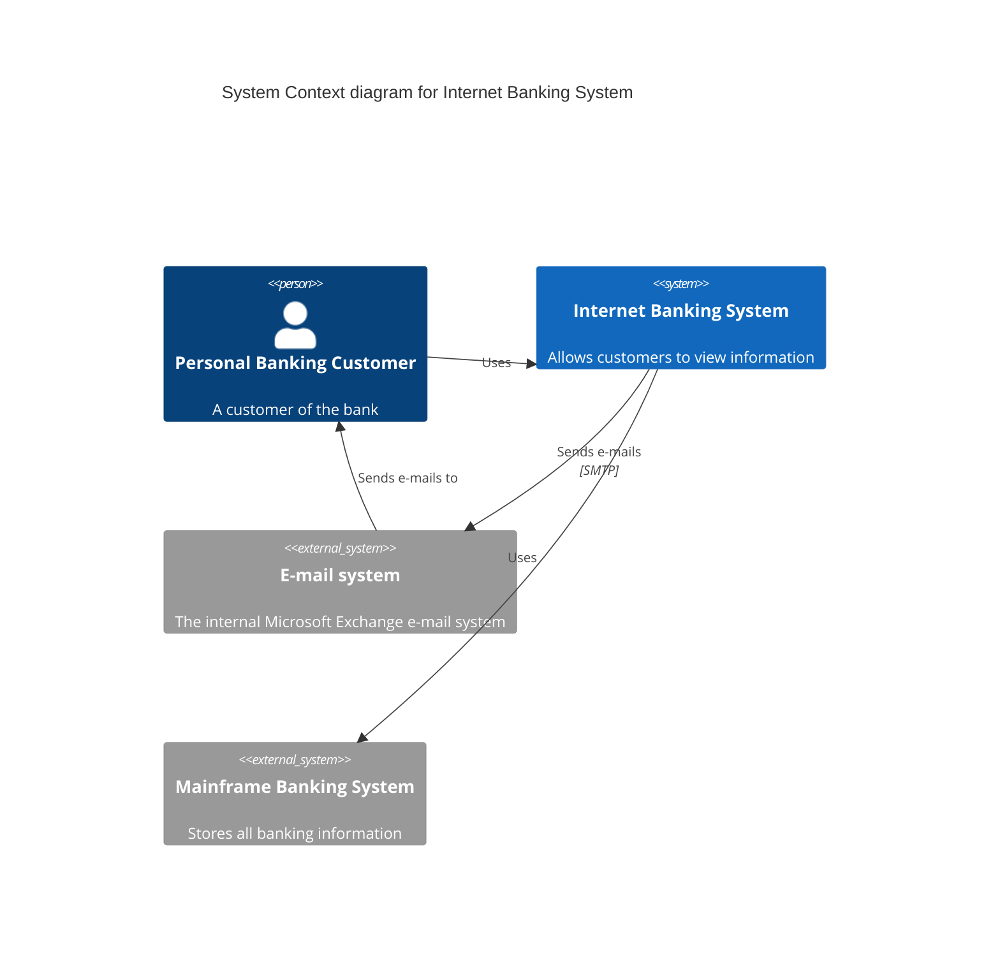
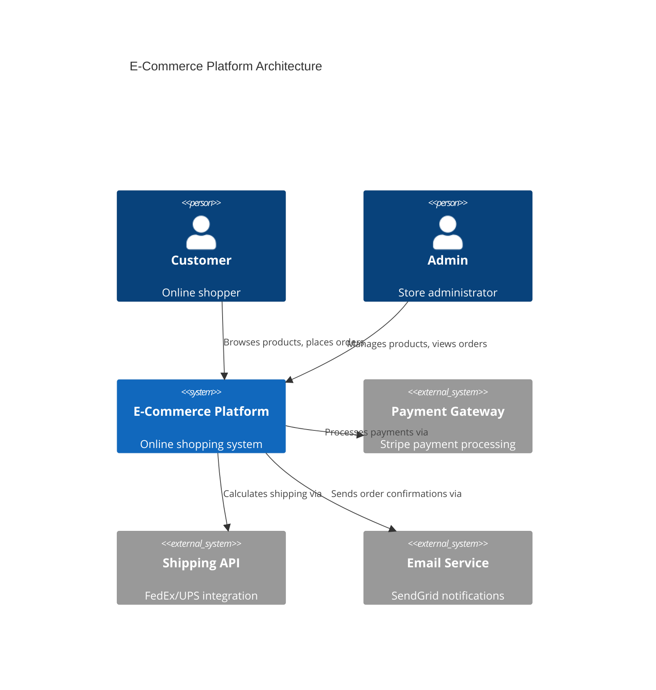
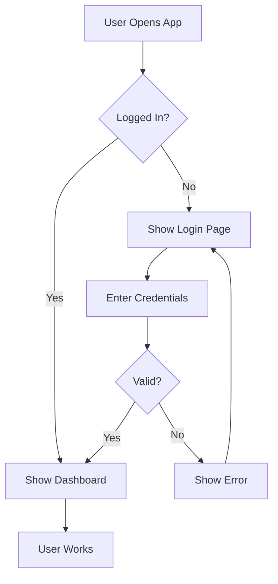
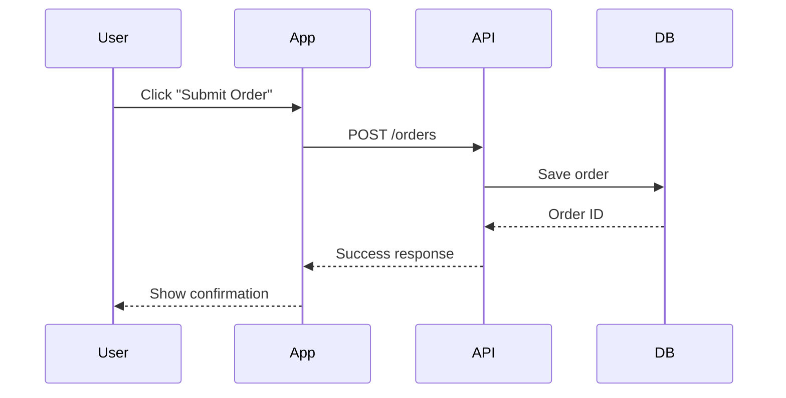

# Quick Start: Creating Your First Text-Based Diagram

## 5-Minute Tutorial

### Step 1: Create a New Diagram

1. Go to **Dashboard → Diagrams**
2. Click the green **"Create New"** button
3. Fill in the form:
   - **Name**: "My First C4 Diagram"
   - **Description**: "System architecture for my project"
   - **Diagram Type**: Select **"Text-Based"**
   - **Category**: Select **"C4 Diagrams"**
4. Click **"Create"**

You'll be redirected to the text editor with a pre-loaded C4 template.

### Step 2: Understand the Interface

The editor has 3 main panels:

- **Left Panel (Code Editor)**: Write your Mermaid syntax here
- **Right Panel (Preview)**: See your rendered diagram
- **Right Sidebar (Documentation)**: Quick syntax reference (click "Docs" to show/hide)

### Step 3: Edit Your First Diagram

The default C4 template looks like this:



### Step 4: Customize It

Let's change it to represent a simple e-commerce system:



### Step 5: Render Your Diagram

1. Click the **"Render"** button in the preview panel header
2. Your diagram will appear in the preview area
3. If there are errors, they'll be shown in red with details

### Step 6: Save and Export

1. Click **"Save"** in the top toolbar (or Ctrl/Cmd + S)
2. To export as SVG, click **"Export"**
3. The SVG file will download to your computer

## Try Different Diagram Types

### Quick Flowchart Example

Create a new diagram, select **"Flowchart"**, and try this:



### Quick Sequence Diagram Example

Create a new diagram, select **"Sequence Diagram"**, and try this:



## Tips for Success

1. **Start with Templates**: Each category has a working template
2. **Use the Docs Panel**: Quick reference for syntax
3. **Render Often**: Click "Render" to check your work
4. **Read Error Messages**: They tell you exactly what's wrong
5. **Keep It Simple**: Start small, add complexity gradually

## Common Syntax Patterns

### C4 Diagrams

```mermaid
Person(id, "Label", "Description")
System(id, "Label", "Description")
System_Ext(id, "Label", "Description")
Rel(from, to, "Label")
```

### Flowcharts

```mermaid
A[Rectangle Box]
B(Rounded Box)
C{Decision Diamond}
D((Circle))
A --> B
B --> C
C -->|Yes| D
```

### Sequence Diagrams

```mermaid
participant Name
Actor1->>Actor2: Message
Actor2-->>Actor1: Response
Note right of Actor2: Note text
```

## Next Steps

1. Explore all 8 diagram categories
2. Read the [Full Diagram Guide](./DIAGRAM_GUIDE.md)
3. Check out [Mermaid Documentation](https://mermaid.js.org/)
4. Experiment with different styles and layouts
5. Export and use in your documentation

## Keyboard Shortcuts

- **Ctrl/Cmd + S**: Save diagram
- **Ctrl/Cmd + C**: Copy code (when code is selected)
- **Escape**: Close panels

## Getting Help

- Click **"Docs"** button for quick syntax reference
- Check the preview error messages
- Visit [Mermaid.js Documentation](https://mermaid.js.org/intro/)
- See examples in [DIAGRAM_GUIDE.md](./DIAGRAM_GUIDE.md)

---

**Ready to create amazing diagrams? Start now!** 🚀
