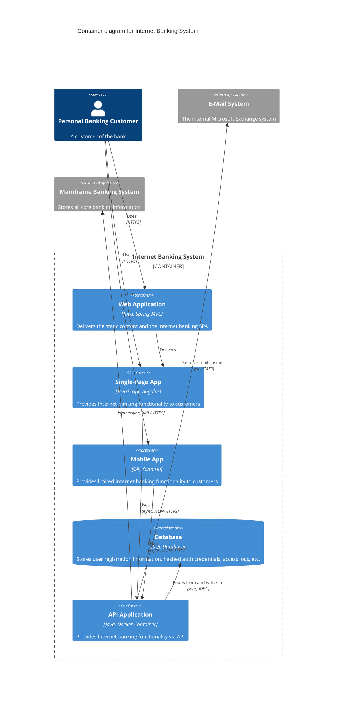
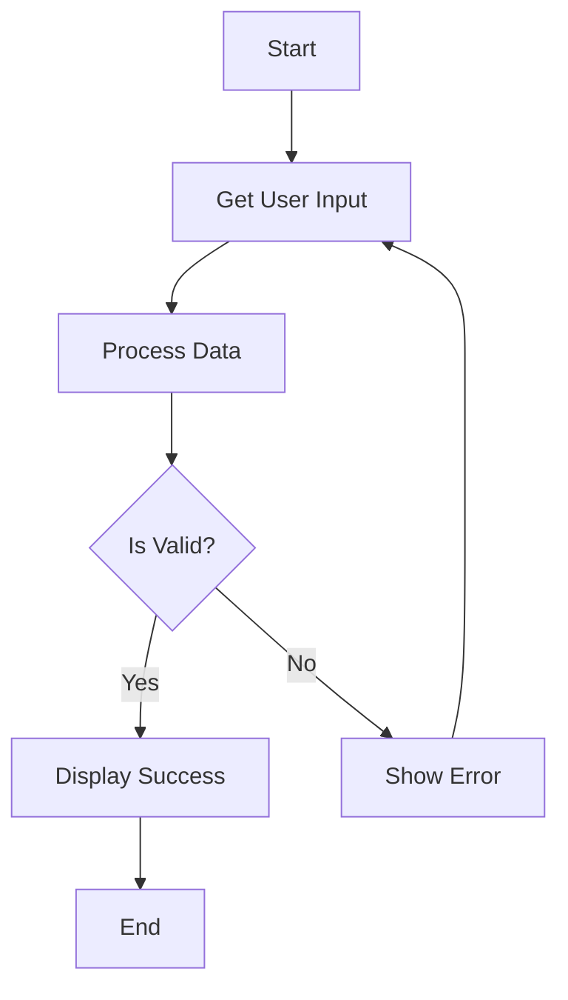
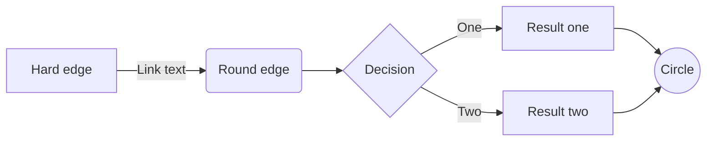
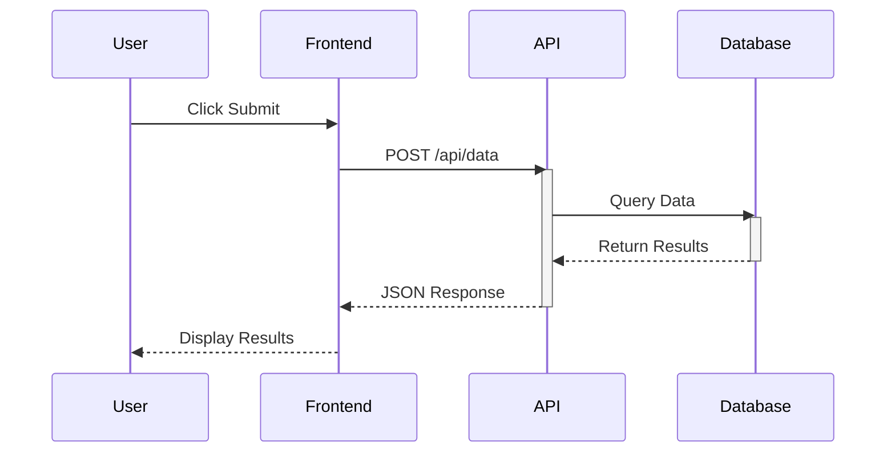
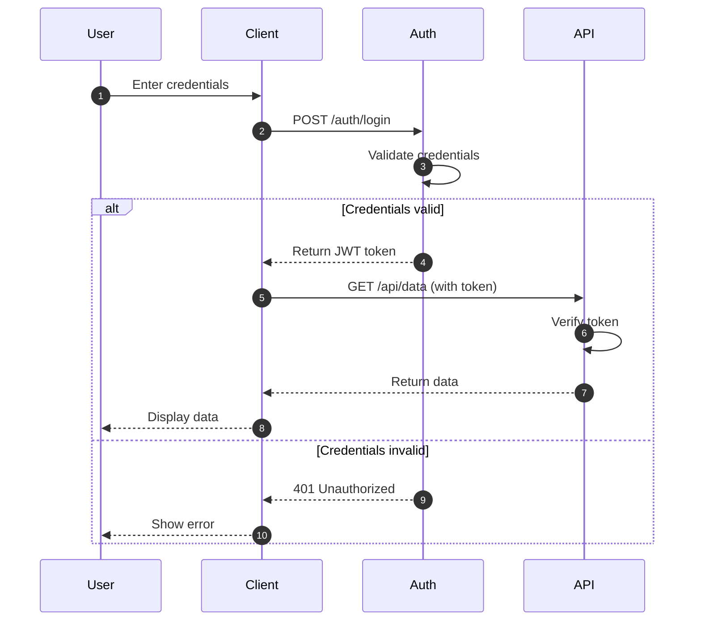
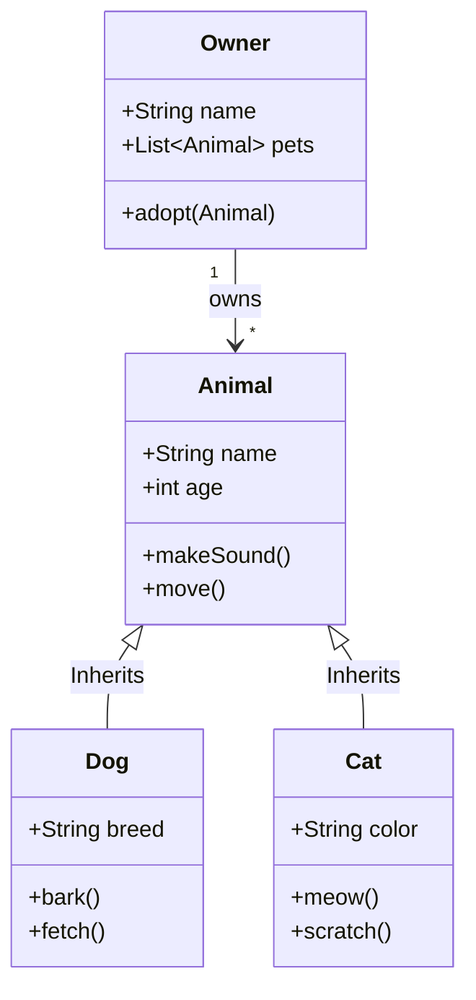
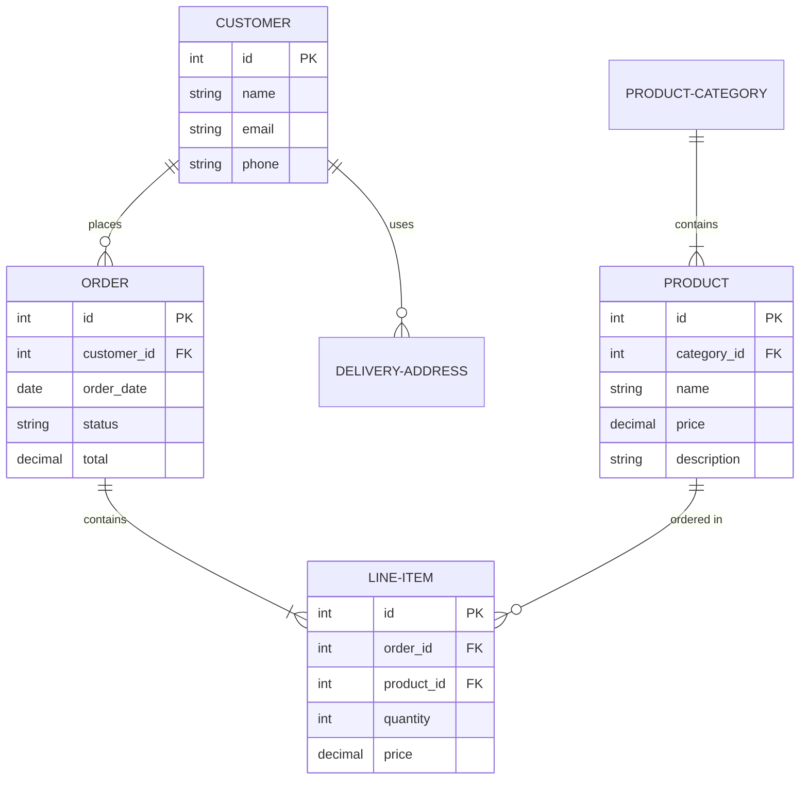
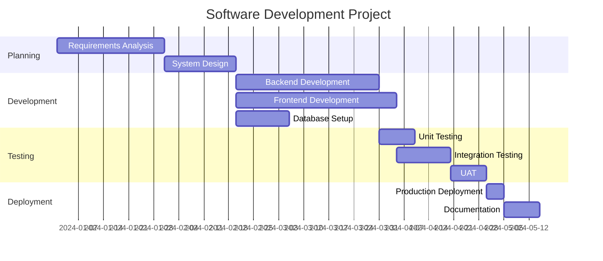
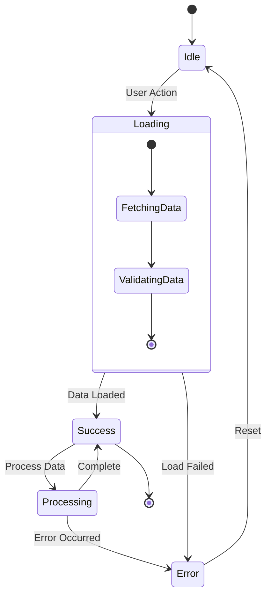
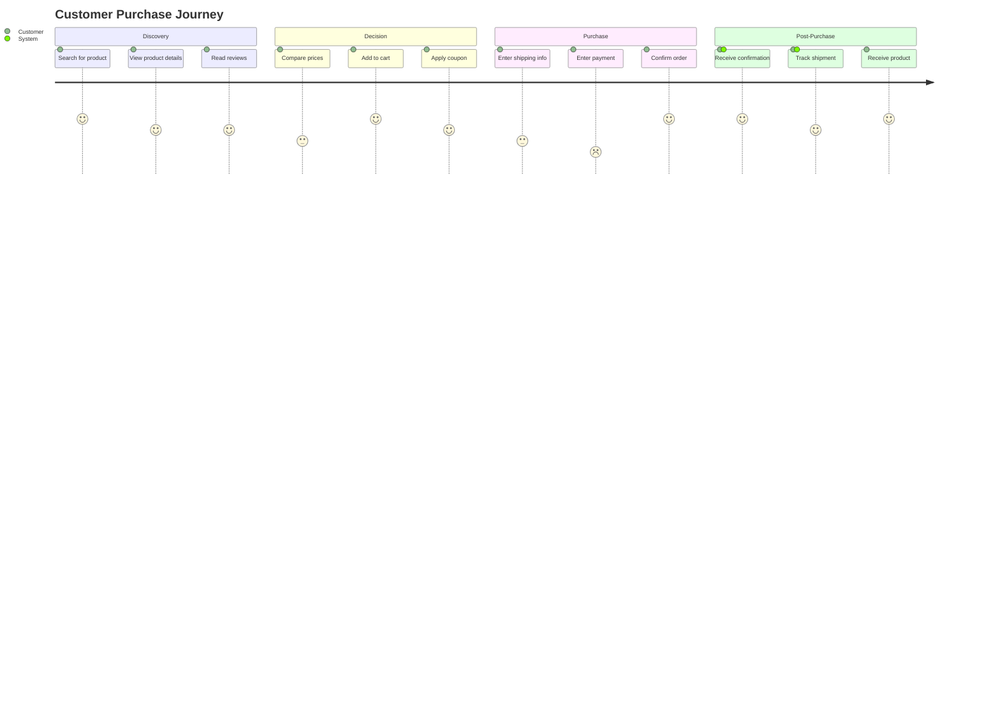

# Text-Based Diagrams Guide

This guide shows you how to create different types of diagrams using text syntax powered by Mermaid.js.

## C4 Diagrams

C4 model diagrams for visualizing software architecture at different levels of abstraction.

### System Context Example

```mermaid
C4Context
title System Context diagram for Internet Banking System

Person(customer, "Personal Banking Customer", "A customer of the bank")
System(banking_system, "Internet Banking System", "Allows customers to view information about their bank accounts")
System_Ext(mail_system, "E-mail system", "The internal Microsoft Exchange e-mail system")
System_Ext(mainframe, "Mainframe Banking System", "Stores all banking information")

Rel(customer, banking_system, "Uses")
Rel_Back(customer, mail_system, "Sends e-mails to")
Rel_Neighbor(banking_system, mail_system, "Sends e-mails", "SMTP")
Rel(banking_system, mainframe, "Uses")
```

### Container Diagram Example



## Flowchart Diagrams

### Basic Flowchart



### Advanced Flowchart



## Sequence Diagrams

### API Call Sequence



### Authentication Flow



## Class Diagrams

### Object-Oriented Design



## Entity Relationship Diagrams

### Database Schema



## Gantt Charts

### Project Timeline



## State Diagrams

### Application States



## User Journey Maps

### Customer Experience



## Tips & Best Practices

1. **C4 Diagrams**: Start with context, then drill down to containers and components
2. **Flowcharts**: Use clear node shapes - rectangles for processes, diamonds for decisions
3. **Sequence Diagrams**: Number interactions for complex flows using `autonumber`
4. **Class Diagrams**: Show relationships clearly with proper multiplicity
5. **ER Diagrams**: Always specify primary keys (PK) and foreign keys (FK)
6. **Gantt Charts**: Use realistic date formats and task dependencies
7. **State Diagrams**: Keep states simple and transitions clear
8. **Journey Maps**: Include emotional ratings (1-5) for each step

## Resources

- [Mermaid Official Documentation](https://mermaid.js.org/)
- [C4 Model](https://c4model.com/)
- [Flowchart Syntax](https://mermaid.js.org/syntax/flowchart.html)
- [Sequence Diagram Syntax](https://mermaid.js.org/syntax/sequenceDiagram.html)
