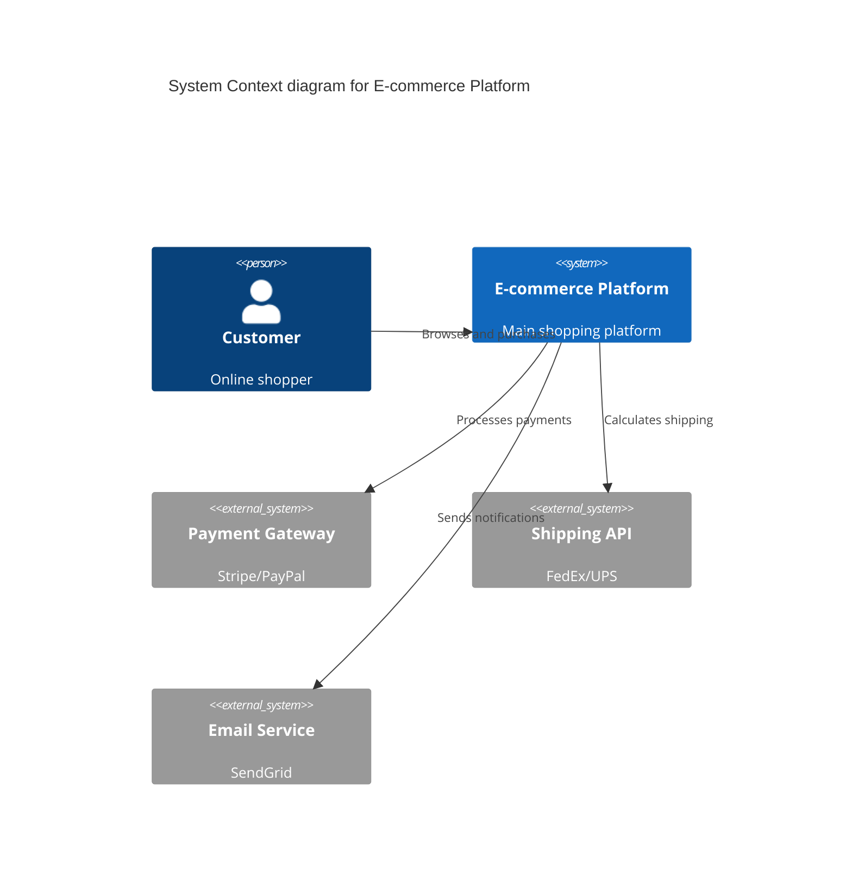
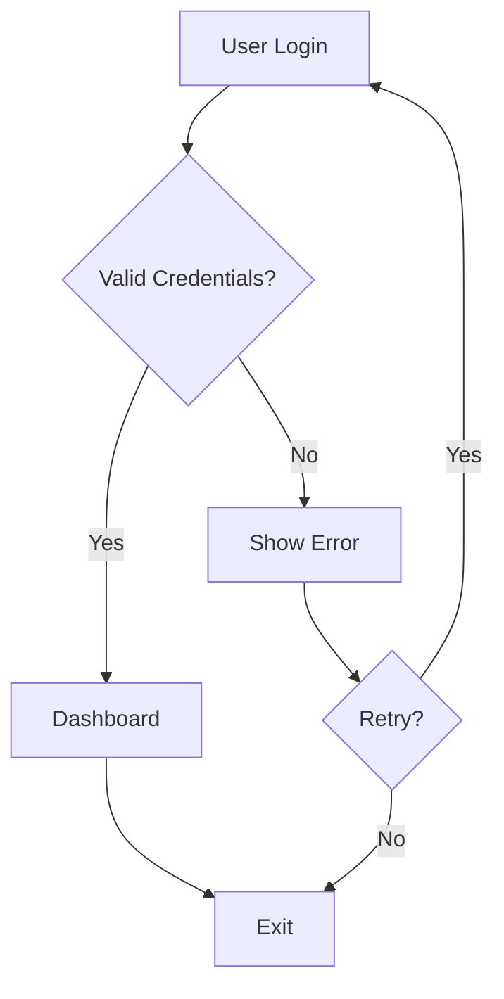

# Flow & Diagrams Feature

## Overview

The Flow & Diagrams feature allows users to create professional diagrams using two methods:

1. **Text-Based Diagrams** (Powered by Mermaid.js) - Write diagrams using simple text syntax
2. **Visual Editor** - Drag-and-drop interface for creating flowcharts

## Text-Based Diagrams

### Supported Diagram Types

#### 1. **C4 Diagrams**

Software architecture diagrams showing system context, containers, and components.

**Use Cases:**

- System architecture documentation
- Software design presentations
- Technical documentation
- API integration maps

**Key Features:**

- System Context diagrams
- Container diagrams
- Component diagrams
- Relationship mapping

#### 2. **Flowcharts**

Process flows and decision trees.

**Use Cases:**

- Business process documentation
- Algorithm visualization
- User flow mapping
- Decision logic

#### 3. **Sequence Diagrams**

Time-ordered interaction diagrams.

**Use Cases:**

- API communication flows
- Authentication sequences
- Multi-system interactions
- Event-driven processes

#### 4. **Class Diagrams**

Object-oriented design and relationships.

**Use Cases:**

- Database models
- OOP design documentation
- Code structure planning
- Design patterns

#### 5. **ER Diagrams**

Entity-relationship database schemas.

**Use Cases:**

- Database design
- Data modeling
- Schema documentation
- Relationship mapping

#### 6. **Gantt Charts**

Project timelines and task dependencies.

**Use Cases:**

- Project planning
- Sprint planning
- Resource allocation
- Timeline visualization

#### 7. **State Diagrams**

State machines and transitions.

**Use Cases:**

- Application state management
- Workflow states
- Status transitions
- Lifecycle documentation

#### 8. **User Journey Maps**

Customer experience and user flows.

**Use Cases:**

- UX design
- Customer experience mapping
- Product feature flows
- User behavior analysis

## Getting Started

### Creating a New Diagram

1. Navigate to **Dashboard → Diagrams**
2. Click **Create New**
3. Enter diagram name and description
4. Select **Text-Based** diagram type
5. Choose a diagram category (C4, Flowchart, etc.)
6. Click **Create**

### Editing Diagrams

The text editor provides:

- **Code Editor**: Write your diagram using Mermaid syntax
- **Live Preview**: See your diagram rendered in real-time
- **Documentation Panel**: Quick reference for syntax
- **Export Options**: Download as SVG

### Editor Features

- **Split View**: Code editor + preview side-by-side
- **Full Preview Mode**: Expand preview to full screen
- **Auto-save**: Changes saved to localStorage
- **Export**: Download diagrams as SVG files
- **Copy Code**: Copy diagram code to clipboard
- **Error Handling**: Clear error messages for syntax issues

## Example: C4 System Context



## Example: Flowchart



## Technical Details

### Technology Stack

- **Mermaid.js**: Diagram rendering engine
- **Next.js 14**: React framework
- **TypeScript**: Type safety
- **localStorage**: Data persistence
- **SVG Export**: Vector graphics output

### Mermaid Configuration

The diagrams use a custom dark theme matching the platform's design:

```javascript
{
  theme: "dark",
  themeVariables: {
    primaryColor: "#00FF99",      // Neon green
    background: "#0A0A0A",        // Dark background
    textColor: "#FFFFFF",         // White text
    lineColor: "#00FF99",         // Green lines
    fontSize: "16px"
  }
}
```

### Data Structure

```typescript
interface Diagram {
  id: string
  name: string
  description: string
  userId: string
  createdAt: string
  updatedAt: string
  diagramType: "text" | "visual"
  category: string  // c4, flowchart, sequence, etc.
  textContent: string  // Mermaid syntax
}
```

## Best Practices

### C4 Diagrams

1. Start with high-level context
2. Use clear, descriptive labels
3. Show only relevant external systems
4. Keep relationship labels concise

### Flowcharts

1. Use consistent shapes for similar actions
2. Ensure one clear start and end point
3. Label decision branches clearly
4. Avoid crossing lines when possible

### Sequence Diagrams

1. Use `autonumber` for complex flows
2. Show activation boxes for processing
3. Use `alt`/`else` for conditional logic
4. Keep participant names short

### ER Diagrams

1. Always mark primary keys (PK)
2. Clearly show foreign keys (FK)
3. Use proper cardinality notation
4. Include essential attributes only

## Keyboard Shortcuts

- **Ctrl/Cmd + S**: Save diagram
- **Ctrl/Cmd + C**: Copy code
- **Escape**: Close modal/panel

## Troubleshooting

### Diagram Not Rendering

- Check syntax using the documentation panel
- Look for error messages in the preview area
- Ensure all opening tags have closing tags
- Verify relationship syntax

### Export Issues

- Ensure diagram renders successfully first
- Check browser console for errors
- Try re-rendering before export

### Performance

- Large diagrams (100+ nodes) may render slowly
- Consider breaking complex diagrams into smaller parts
- Use appropriate zoom levels

## Resources

- [Mermaid Documentation](https://mermaid.js.org/)
- [C4 Model Guide](https://c4model.com/)
- [Diagram Guide](../docs/DIAGRAM_GUIDE.md)

## Future Enhancements

- [ ] Real-time collaboration
- [ ] Version history
- [ ] Template library
- [ ] PNG/PDF export
- [ ] Diagram sharing with public URLs
- [ ] Import from other tools
- [ ] AI-assisted diagram generation
- [ ] Team diagram libraries

## Support

For issues or feature requests:

- Check the [DIAGRAM_GUIDE.md](../docs/DIAGRAM_GUIDE.md) for examples
- Review Mermaid.js documentation
- File an issue on GitHub
